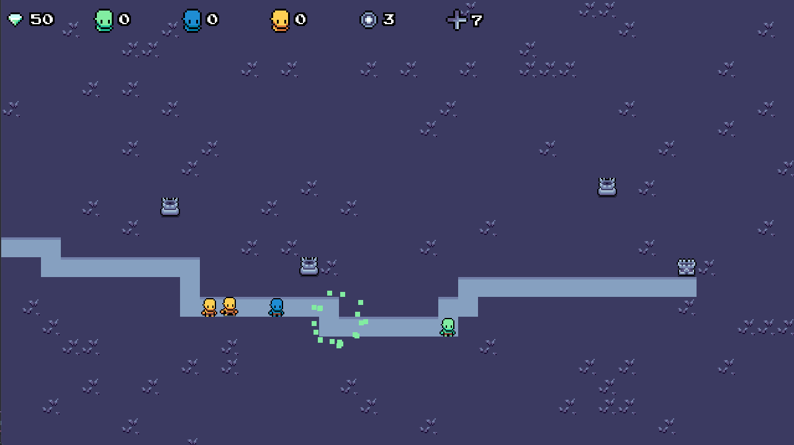
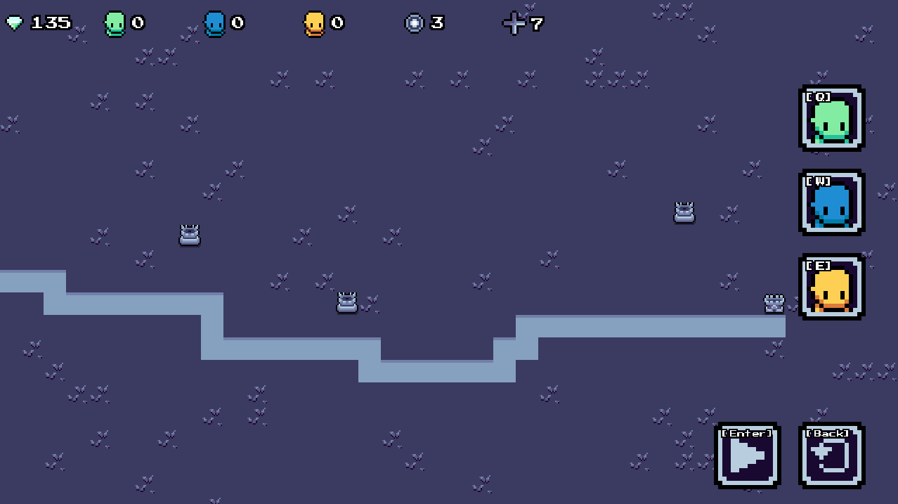
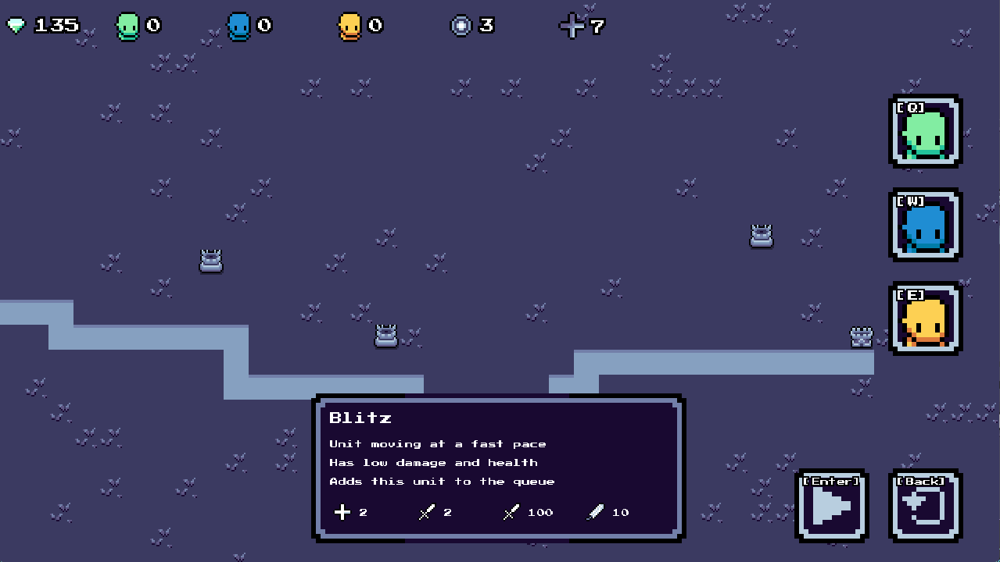
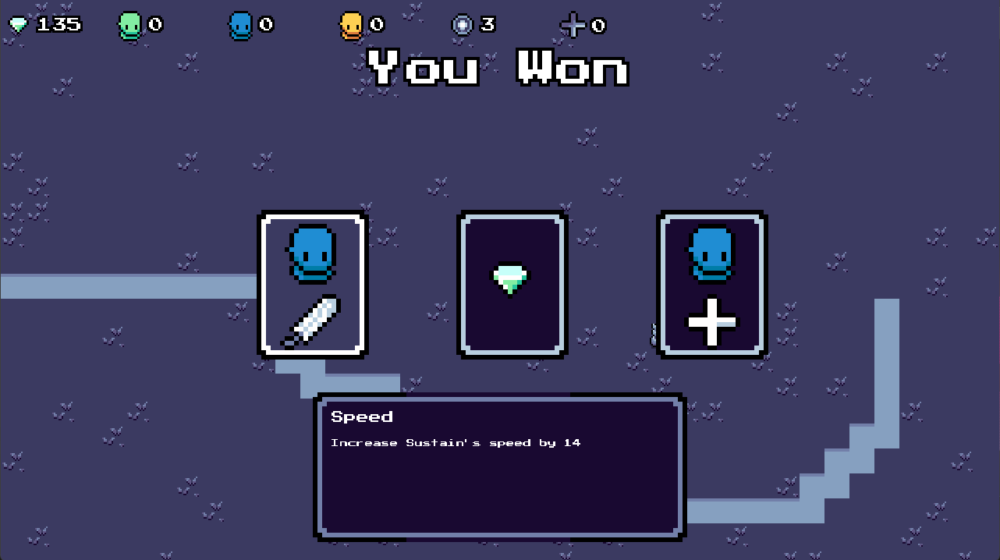
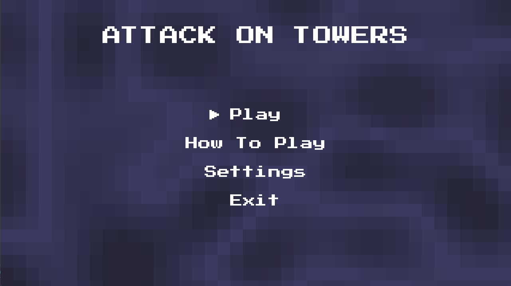
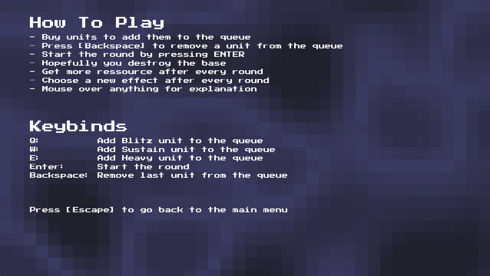

# Hackaton project - code name Jade

### Trailer
https://www.youtube.com/watch?v=9tQZD-lSsUs

### How to build

Simply run `dotnet build` from the root directory. Alternatively, you can run `dotnet run` to play the game.

### What is the project

This game is a reverse tower defense where you play as the attackant instead of the defender. It was developed from scratch using MonoGame in four days in the span of around 45 hours.

It is built on ideas of tower defense and rogue like games where you have to plan your attack by selecting the appropriate units in order to destroy the enemy base. After each round, you get to select a random buff for your units such as:

- Increase movement speed
- Increase damage
- Increase health
- Increase player's currency

Those are selected at random and allow you to create builds based on which units have become more powerful. Maybe your initial slow units which are more tanky suddently have more movement speed or even more health.

Finally, every round is randomly generated and a new tower is added every round. Meaning that at round 5, there are 5 towers attacking your units, at round 6, there are 6, etc.

### Screenshots

### Credits
song: Joshua McLean - Mountain Trials
